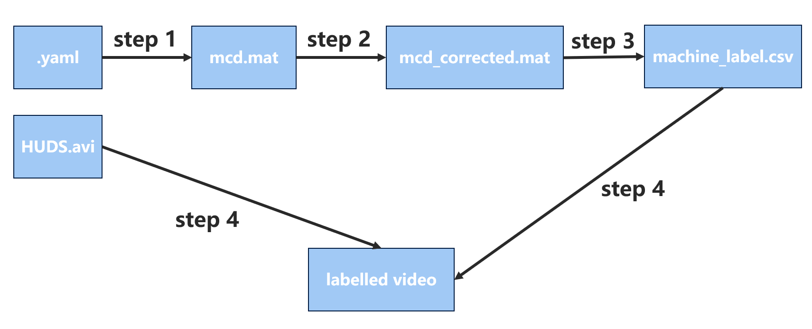

## The Structure of the Data Folder

The structure of the data folder should be organized as below:

    Data
    │
    ├── w1
    │   ├── *.avi
    │   ├── *.yaml
    │   └── *_HUDS.avi
    │
    ├── w2
    │   ├── *.avi
    │   ├── *.yaml
    │   └── *_HUDS.avi
    │
    ├── w3
    │   ├── *.avi
    │   ├── *.yaml
    │   └── *_HUDS.avi
    ...

## Workflow 

