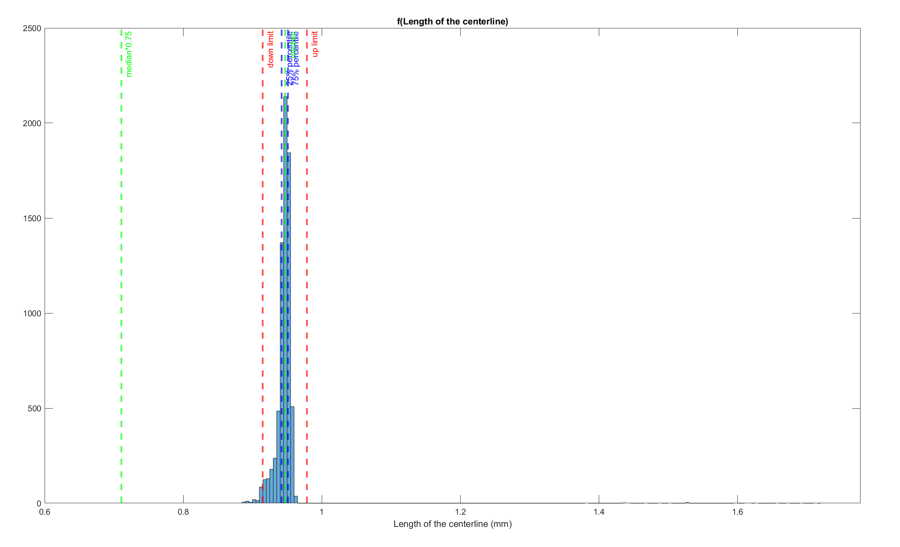

# Bug

If there is no head-touching-body-turn in a video, the histogram will look like below, where Tukey test will give wrong results.

(figure: WEN0216-Or20230524-w3)

# Fix

To fix this, I introduce a double check in round 1.